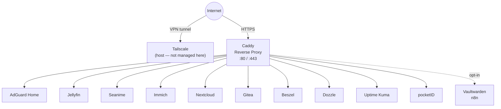
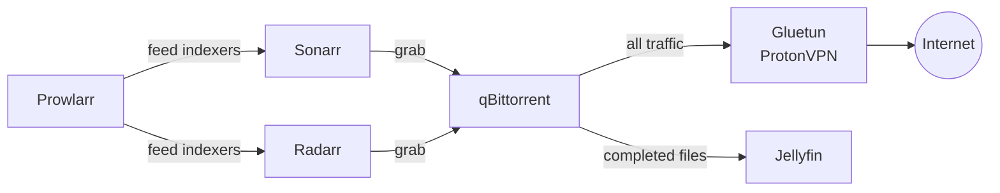

# homelab

A quick, reproducible setup for my personal homelab. Not an exhaustive list — just the things that make life fun and easy to have.

Each stack lives in its own Docker Compose file. Everything is bootstrapped and operated via a `justfile`.

> **Not managed here:** Tailscale runs directly on the host. It provides the VPN tunnel, SSH access, and LAN routing. Docker never touches it.

---

## Philosophy

- **Dedicated compose file per stack** — bring up only what you need, independently
- **Host-mounted storage** — all persistent data lives under `${HOST_MOUNT_ROOT:-/mnt/docker}/<service>`, no named volumes
- **UID/GID passthrough** — every service runs as the invoking user's UID/GID, sourced at `just` runtime, no permission errors ever
- **`.env` for all config and secrets** — `.env.example` documents every required variable including timezone
- **`just` for everything** — one recipe to bring up the full stack, or granular per-stack control
- **Extras are opt-in** — the default `just up` does not boot extras; they have their own explicit recipes

---

## Repository Structure

```
homelab/
├── core/
│   ├── docker-compose.yml      # AdGuard Home + Caddy
│   └── Caddyfile               # Static reverse proxy config (uses env vars)
├── media/
│   └── docker-compose.yml      # Jellyfin + Sonarr + Radarr + Prowlarr + qBittorrent + Gluetun
├── cloud/
│   └── docker-compose.yml      # Immich + Nextcloud
├── dev/
│   └── docker-compose.yml      # Gitea + GitHub Actions Runner
├── obs/
│   └── docker-compose.yml      # Beszel + Dozzle + Uptime Kuma
├── auth/
│   └── docker-compose.yml      # pocketID
├── extras/
│   └── docker-compose.yml      # Vaultwarden + n8n
├── .env                        # Your actual secrets (gitignored)
├── .env.example                # Template — copy to .env and fill in
├── .gitignore
└── justfile
```

---

## Stacks

### Core
| Service | Role |
|---------|------|
| AdGuard Home | Network-wide DNS with ad blocking |
| Caddy | Reverse proxy with automatic HTTPS via env-injected domain config |

### Media
| Service | Role |
|---------|------|
| Jellyfin | Media server |
| Seanime | Self-hosted anime client/server (third-party Docker image) |
| Sonarr | TV show automation |
| Radarr | Movie automation |
| Prowlarr | Indexer manager — feeds Sonarr and Radarr |
| qBittorrent | Torrent client — network routed through Gluetun |
| Gluetun | ProtonVPN tunnel — all qBittorrent traffic exits here |

### Cloud
| Service | Role |
|---------|------|
| Immich | Self-hosted photo and video backup (Google Photos replacement) |
| Nextcloud | Self-hosted file sync and collaboration (Google Drive replacement) |

### Dev
| Service | Role |
|---------|------|
| Gitea | Self-hosted Git forge |
| GitHub Actions Runner | Personal self-hosted CI runner for GitHub repos (e.g. building images, pushing to ECS). Opt-in profile (`just up-runner`). |

### Obs
| Service | Role |
|---------|------|
| Beszel | Host and container metrics — lightweight agent-based hub with a clean UI |
| Dozzle | Real-time Docker log viewer — no storage, just live tailing |
| Uptime Kuma | External uptime monitoring — pings services and alerts when they go down |

### Auth
| Service | Role |
|---------|------|
| pocketID | Identity provider and SSO — configure integrations manually after boot |

### Extras *(opt-in only)*
| Service | Role |
|---------|------|
| Vaultwarden | Self-hosted Bitwarden-compatible password manager |
| n8n | Workflow automation |

---

## Network & Storage

### Docker Network

All stacks share a single external Docker bridge network called `homelab`. This allows Caddy (in the `core` stack) to reach services in any other stack by container name.

**Exception:** qBittorrent uses `network_mode: service:gluetun` — its traffic exits entirely through the Gluetun VPN container.

Gitea exposes Git-over-SSH on host port `2222` so it does not collide with the host's own SSH daemon on `22`.

### Host Storage

All persistent data is host-mounted under `${HOST_MOUNT_ROOT:-/mnt/docker}`. The `justfile` runs `mkdir -p` for every required path before any stack boots.

- If `HOST_MOUNT_ROOT` is not set, the default is `/mnt/docker`.
- For local laptops/dev boxes without write access to `/mnt`, set `HOST_MOUNT_ROOT` in `.env` (for example: `/home/<user>/homelab-data`).

If DNS port 53 is already used on your machine (common on laptops via `systemd-resolved`), set these in `.env` for local testing:

- `ADGUARD_DNS_PORT_TCP=5353`
- `ADGUARD_DNS_PORT_UDP=5353`

Production can keep both at `53` when the host is dedicated.

```
/mnt/docker/
├── adguard/
├── caddy/
├── jellyfin/
├── seanime/
├── sonarr/
├── radarr/
├── prowlarr/
├── qbittorrent/
├── gluetun/
├── immich/
├── nextcloud/
├── gitea/
├── gh-runner/
├── beszel/
├── uptime-kuma/
├── pocketid/
├── vaultwarden/
└── n8n/
```

Directories are created with ownership set to the UID/GID of the user running `just`. Services are configured with the same UID/GID via `PUID`/`PGID` in `.env`.

For the GitHub runner, workspace and runner registration state are persisted separately under `${HOST_MOUNT_ROOT:-/mnt/docker}/gh-runner/work` and `${HOST_MOUNT_ROOT:-/mnt/docker}/gh-runner/config` so container recreation does not force a fresh runner registration.

---

## Flow

### Traffic



### Media Pipeline



---

## Quickstart

```bash
# 1. Clone and enter
git clone <repo> homelab && cd homelab

# 2. Set up your environment
cp .env.example .env
$EDITOR .env

# 3. One-time setup (network + host directories)
just init

# 4. Bring up everything (excludes extras)
just up

# 5. Or bring up individual stacks
just up-core
just up-media
just up-cloud
just up-dev
just up-obs
just up-auth

# Runner is opt-in (requires runner env vars)
just up-runner

# Extras are always explicit
just up-extras

# Tear down
just down
just down-core   # etc.
```

---

## Startup & Config Flow

### Recommended First Boot Order

If you want the least surprising startup path, use this order:

```bash
just init
just pull
just up
```

Then finish the parts that intentionally require UI-driven setup:

1. AdGuard: visit `http://<host>:3000` and complete the first-run wizard.
2. Beszel: open the self-hosted hub UI and fetch either a system `KEY` from `Add System` or a universal token from `/settings/tokens`.
3. pocketID: create providers, applications, and policies in the UI.
4. Uptime Kuma: add monitors in the UI.
5. GitHub runner: only start it after you have a fresh runner registration token from GitHub.

For Beszel specifically, the hub can boot before the agent is fully configured. A practical flow is:

```bash
just init
just pull
just up
# fetch BESZEL_KEY from the self-hosted Beszel UI
just up-obs
```

The second `just up-obs` recreates `beszel-agent` with the updated environment.

### Restart vs Recreate vs Rebuild

This repo does not currently build any local images. All active services use published upstream images, and none of the compose files define `build:` entries.

- **Rebuild:** not required for normal operation, because nothing is built locally.
- **Recreate:** required when you change `.env`, ports, commands, volumes, or any compose-level environment variables. Running `just up-<stack>` again is the normal way to apply those changes.
- **Restart only:** sufficient when the container can reread existing on-disk application config. `just restart <service>` only restarts the current container; it does **not** apply changed `.env` values.

Rule of thumb:

- If you changed `.env`, rerun `just up-<stack>` for the affected stack.
- If you changed only settings inside the application's UI, container recreation is usually not needed.
- If you changed a bootstrap credential for a stateful app after its data directory already exists, the new env value may not retroactively rewrite the app's internal state.

### UI-Issued Values and External Tokens

Some required values are not made up manually. They come from a self-hosted UI or an external control plane and then get copied into `.env` before recreating the relevant stack.

| Service | Value | Where it comes from | Apply by |
|---------|-------|---------------------|----------|
| Beszel agent | `BESZEL_KEY` | Beszel Hub UI → `Add System` | `just up-obs` |
| Beszel agent | universal token | Beszel Hub UI → `/settings/tokens` | Not wired into this repo yet |
| GitHub runner | `GITHUB_RUNNER_TOKEN` | GitHub repo → Settings → Actions → Runners | `just up-runner` |

---

## Caddyfile & Domains

The `Caddyfile` is checked into the repo but contains **no hardcoded hostnames**. All domain names are injected via environment variables at runtime:

```
{env.TS_DOMAIN}        # your Tailscale tailnet name (e.g. tail1234.ts.net)
{env.LOCAL_DOMAIN}     # your local domain if you have one (e.g. home.internal)
```

These are set in `.env` which is gitignored. `.env.example` shows the expected format.

### TLS Strategy

By default, Caddy uses `tls internal`. That means Caddy acts as its own private certificate authority and issues certs for `*.${TS_DOMAIN}` itself.

- This is **not** using Tailscale-issued certificates.
- It works well for a private tailnet because traffic is still fully encrypted.
- Your devices will only trust those certs after you import Caddy's root CA from `${HOST_MOUNT_ROOT:-/mnt/docker}/caddy/data/caddy/pki/authorities/local/root.crt`.

If you later want browser-trusted certs without importing a custom CA, there are two upgrade paths:

- Use a real public domain and switch Caddy to ACME / Let's Encrypt
- Generate Tailscale certs on the host with `tailscale cert` and mount them into Caddy manually

This repo keeps the default on `tls internal` because it is simple, reproducible, and does not couple the Caddy container to host-level Tailscale certificate management.

---

## Environment Variables

All configuration lives in `.env`. Never commit this file. Copy `.env.example` to get started:

```bash
cp .env.example .env
```

See `.env.example` for the full list. Key categories:

| Category | Variables |
|----------|-----------|
| System | `TZ`, `PUID`, `PGID`, `HOST_MOUNT_ROOT`, `ADGUARD_DNS_PORT_TCP`, `ADGUARD_DNS_PORT_UDP` |
| Domains | `TS_DOMAIN`, `LOCAL_DOMAIN`, `ACME_EMAIL` |
| VPN | `VPN_SERVICE_PROVIDER`, `VPN_TYPE`, `OPENVPN_USER`, `OPENVPN_PASSWORD` |
| Beszel | `BESZEL_KEY` |
| Immich | `IMMICH_DB_PASSWORD` |
| Nextcloud | `NEXTCLOUD_ADMIN_USER`, `NEXTCLOUD_ADMIN_PASSWORD`, `NEXTCLOUD_MYSQL_ROOT_PASSWORD`, `NEXTCLOUD_MYSQL_PASSWORD`, `NEXTCLOUD_MYSQL_DATABASE`, `NEXTCLOUD_MYSQL_USER` |
| pocketID | `POCKETID_SECRET_KEY`, `POCKETID_POSTGRES_PASSWORD`, `POCKETID_POSTGRES_USER`, `POCKETID_POSTGRES_DB` |
| GitHub Runner | `GITHUB_RUNNER_TOKEN`, `GITHUB_RUNNER_REPO`, `GITHUB_RUNNER_NAME` |
| Extras | `VAULTWARDEN_ADMIN_TOKEN`, `N8N_BASIC_AUTH_USER`, `N8N_BASIC_AUTH_PASSWORD`, `N8N_ENCRYPTION_KEY` |

### Seanime Notes

- This setup uses the official Seanime docs' recommended third-party image `umagistr/seanime`.
- Upstream note: this image is community-maintained and not maintained by Seanime.
- The service is exposed through Caddy at `https://anime.${TS_DOMAIN}`.
- Seanime is configured to run rootless using Docker's native `user: "${PUID}:${PGID}"` mapping.
- The Seanime config directory is persisted at `${HOST_MOUNT_ROOT:-/mnt/docker}/seanime`.
- For hosted access, set a server password in Seanime's `config.toml` after first boot (as recommended by Seanime docs).

`just up-dev` starts Gitea only. Start the GitHub runner explicitly with `just up-runner` after setting runner credentials in `.env`.

`PUID` and `PGID` still exist in `.env.example` for clarity, but `just` exports the runtime UID/GID of whoever invokes it, so the effective values come from the current shell user.

### What Needs Recreate vs In-App Reconfiguration

| Stack | Values / setup | What changes need container recreation | What is UI-only after boot |
|-------|----------------|----------------------------------------|----------------------------|
| Core | `TZ`, `HOST_MOUNT_ROOT`, `ADGUARD_DNS_PORT_TCP`, `ADGUARD_DNS_PORT_UDP`, `TS_DOMAIN`, `LOCAL_DOMAIN`, `ACME_EMAIL` | Any `.env` change here should be applied with `just up-core` because ports, Caddy env, and bind mounts are container-level | AdGuard first-run setup on port `3000` writes app config to disk |
| Media | ProtonVPN creds and provider settings, `TZ`, bind root | Use `just up-media` after env changes | Sonarr, Radarr, Prowlarr, qBittorrent, Jellyfin, and Seanime are mainly configured in their UIs |
| Cloud | Immich DB password, Nextcloud DB/admin/bootstrap values, domain-derived overwrite settings | Use `just up-cloud` after env changes | Immich libraries and most Nextcloud app settings are in-app after boot |
| Dev | `TS_DOMAIN` for Gitea URLs, runner repo/token/name | Use `just up-dev` for Gitea env changes and `just up-runner` for runner env changes | Gitea repos/orgs/users are UI-managed |
| Obs | `BESZEL_KEY` and future Beszel agent auth env, bind root | Use `just up-obs` after changing Beszel agent auth | Uptime Kuma monitors and Beszel system definitions come from the UI |
| Auth | `POCKETID_SECRET_KEY`, Postgres credentials, bind root | Use `just up-auth` after env changes | pocketID providers, applications, flows, and policies are UI-managed |
| Extras | Vaultwarden admin token, n8n auth and encryption key | Use `just up-extras` after env changes | Vaultwarden users/orgs and n8n workflows are UI-managed |

### Bootstrap-Sensitive Values

These values deserve extra care because changing them later may not fully rewrite already-initialized application state:

- `NEXTCLOUD_ADMIN_USER` and `NEXTCLOUD_ADMIN_PASSWORD` are intended for first bootstrap of the mounted Nextcloud data directory.
- `NEXTCLOUD_MYSQL_*` values are database bootstrap inputs; changing them later usually means coordinating MariaDB and Nextcloud state, not only recreating containers.
- `POCKETID_POSTGRES_*` values work the same way for pocketID's Postgres database.
- `POCKETID_SECRET_KEY` should be treated as persistent instance identity material, not something to rotate casually.
- `N8N_ENCRYPTION_KEY` protects stored credentials at rest; changing it later can make existing encrypted credentials unreadable.
- `GITHUB_RUNNER_TOKEN` is a short-lived registration token from GitHub; use a fresh one when registering or re-registering the runner.

### Beszel Notes

This repo currently wires the Beszel agent as:

```text
KEY=${BESZEL_KEY}
```

That means the operational flow today is:

1. Start the hub with `just up` or `just up-obs`.
2. Open the self-hosted Beszel UI.
3. Fetch the agent public key from `Add System`.
4. Paste it into `.env` as `BESZEL_KEY`.
5. Rerun `just up-obs` to recreate `beszel-agent` with the new value.

Beszel also supports a universal token flow from `/settings/tokens`, but that is not yet wired into `obs/docker-compose.yml` in this repo.

## Healthchecks

Every stack now defines container healthchecks so Docker has an actual readiness signal instead of only a running process state.

- Databases and caches use native readiness checks such as `pg_isready`, `redis-cli ping`, and MariaDB's `healthcheck.sh`.
- Dependency-heavy apps such as Immich, Nextcloud, Authentik, qBittorrent, and the GitHub runner gate startup with `depends_on: condition: service_healthy`.
- The GitHub runner persists both working files and runner registration state, so recreating the container does not normally require re-registration.

---

## Requirements

- Docker Engine with Compose v2 (`docker compose`)
- [`just`](https://github.com/casey/just) — command runner
- Tailscale installed, authenticated, and running on the host
