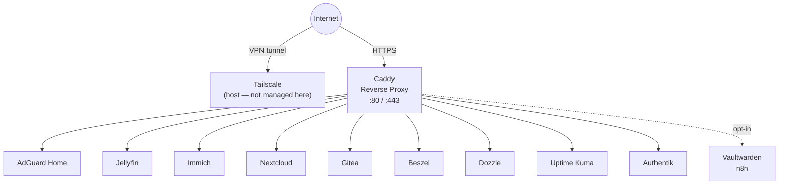
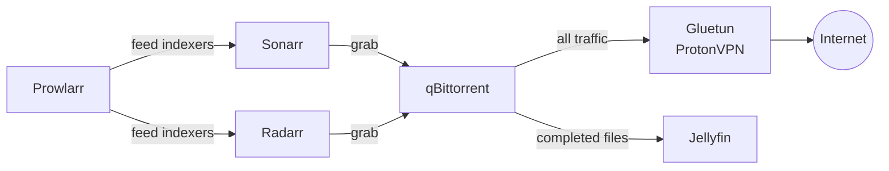

# homelab

A quick, reproducible setup for my personal homelab. Not an exhaustive list — just the things that make life fun and easy to have.

Each stack lives in its own Docker Compose file. Custom images (where needed) use a `Dockerfile.service` in the same directory. Everything is bootstrapped and operated via a `justfile`.

> **Not managed here:** Tailscale runs directly on the host. It provides the VPN tunnel, SSH access, and LAN routing. Docker never touches it.

---

## Philosophy

- **Dedicated compose file per stack** — bring up only what you need, independently
- **Host-mounted storage** — all persistent data lives under `${HOST_MOUNT_ROOT:-/mnt/docker}/<service>`, no named volumes
- **UID/GID passthrough** — every service runs as the invoking user's UID/GID, sourced at `just` runtime, no permission errors ever
- **`.env` for all config and secrets** — `.env.example` documents every required variable including timezone
- **`just` for everything** — one recipe to bring up the full stack, or granular per-stack control
- **Extras are opt-in** — the default `just up` does not boot extras; they have their own explicit recipes

---

## Repository Structure

```
homelab/
├── core/
│   ├── docker-compose.yml      # AdGuard Home + Caddy
│   └── Caddyfile               # Static reverse proxy config (uses env vars)
├── media/
│   └── docker-compose.yml      # Jellyfin + Sonarr + Radarr + Prowlarr + qBittorrent + Gluetun
├── cloud/
│   └── docker-compose.yml      # Immich + Nextcloud
├── dev/
│   └── docker-compose.yml      # Gitea + GitHub Actions Runner
├── obs/
│   └── docker-compose.yml      # Beszel + Dozzle + Uptime Kuma
├── auth/
│   └── docker-compose.yml      # Authentik
├── extras/
│   └── docker-compose.yml      # Vaultwarden + n8n
├── .env                        # Your actual secrets (gitignored)
├── .env.example                # Template — copy to .env and fill in
├── .gitignore
└── justfile
```

---

## Stacks

### Core
| Service | Role |
|---------|------|
| AdGuard Home | Network-wide DNS with ad blocking |
| Caddy | Reverse proxy with automatic HTTPS via env-injected domain config |

### Media
| Service | Role |
|---------|------|
| Jellyfin | Media server |
| Sonarr | TV show automation |
| Radarr | Movie automation |
| Prowlarr | Indexer manager — feeds Sonarr and Radarr |
| qBittorrent | Torrent client — network routed through Gluetun |
| Gluetun | ProtonVPN tunnel — all qBittorrent traffic exits here |

### Cloud
| Service | Role |
|---------|------|
| Immich | Self-hosted photo and video backup (Google Photos replacement) |
| Nextcloud | Self-hosted file sync and collaboration (Google Drive replacement) |

### Dev
| Service | Role |
|---------|------|
| Gitea | Self-hosted Git forge |
| GitHub Actions Runner | Personal self-hosted CI runner for GitHub repos (e.g. building images, pushing to ECS). Opt-in profile (`just up-runner`). |

### Obs
| Service | Role |
|---------|------|
| Beszel | Host and container metrics — lightweight agent-based hub with a clean UI |
| Dozzle | Real-time Docker log viewer — no storage, just live tailing |
| Uptime Kuma | External uptime monitoring — pings services and alerts when they go down |

### Auth
| Service | Role |
|---------|------|
| Authentik | Identity provider and SSO — configure integrations manually after boot |

### Extras *(opt-in only)*
| Service | Role |
|---------|------|
| Vaultwarden | Self-hosted Bitwarden-compatible password manager |
| n8n | Workflow automation |

---

## Network & Storage

### Docker Network

All stacks share a single external Docker bridge network called `homelab`. This allows Caddy (in the `core` stack) to reach services in any other stack by container name.

**Exception:** qBittorrent uses `network_mode: service:gluetun` — its traffic exits entirely through the Gluetun VPN container.

Gitea exposes Git-over-SSH on host port `2222` so it does not collide with the host's own SSH daemon on `22`.

### Host Storage

All persistent data is host-mounted under `${HOST_MOUNT_ROOT:-/mnt/docker}`. The `justfile` runs `mkdir -p` for every required path before any stack boots.

- If `HOST_MOUNT_ROOT` is not set, the default is `/mnt/docker`.
- For local laptops/dev boxes without write access to `/mnt`, set `HOST_MOUNT_ROOT` in `.env` (for example: `/home/<user>/homelab-data`).

If DNS port 53 is already used on your machine (common on laptops via `systemd-resolved`), set these in `.env` for local testing:

- `ADGUARD_DNS_PORT_TCP=5353`
- `ADGUARD_DNS_PORT_UDP=5353`

Production can keep both at `53` when the host is dedicated.

```
/mnt/docker/
├── adguard/
├── caddy/
├── jellyfin/
├── sonarr/
├── radarr/
├── prowlarr/
├── qbittorrent/
├── gluetun/
├── immich/
├── nextcloud/
├── gitea/
├── gh-runner/
├── beszel/
├── uptime-kuma/
├── authentik/
├── vaultwarden/
└── n8n/
```

Directories are created with ownership set to the UID/GID of the user running `just`. Services are configured with the same UID/GID via `PUID`/`PGID` in `.env`.

For the GitHub runner, workspace and runner registration state are persisted separately under `${HOST_MOUNT_ROOT:-/mnt/docker}/gh-runner/work` and `${HOST_MOUNT_ROOT:-/mnt/docker}/gh-runner/config` so container recreation does not force a fresh runner registration.

---

## Flow

### Traffic



### Media Pipeline



---

## Quickstart

```bash
# 1. Clone and enter
git clone <repo> homelab && cd homelab

# 2. Set up your environment
cp .env.example .env
$EDITOR .env

# 3. Create the Docker network (once)
docker network create homelab

# 4. Bring up everything (excludes extras)
just up

# 5. Or bring up individual stacks
just up-core
just up-media
just up-cloud
just up-dev
just up-obs
just up-auth

# Runner is opt-in (requires runner env vars)
just up-runner

# Extras are always explicit
just up-extras

# Tear down
just down
just down-core   # etc.
```

---

## Caddyfile & Domains

The `Caddyfile` is checked into the repo but contains **no hardcoded hostnames**. All domain names are injected via environment variables at runtime:

```
{env.TS_DOMAIN}        # your Tailscale machine hostname (e.g. myserver.tail1234.ts.net)
{env.LOCAL_DOMAIN}     # your local domain if you have one (e.g. home.internal)
```

These are set in `.env` which is gitignored. `.env.example` shows the expected format.

### TLS Strategy

By default, Caddy uses `tls internal`. That means Caddy acts as its own private certificate authority and issues certs for `*.${TS_DOMAIN}` itself.

- This is **not** using Tailscale-issued certificates.
- It works well for a private tailnet because traffic is still fully encrypted.
- Your devices will only trust those certs after you import Caddy's root CA from `${HOST_MOUNT_ROOT:-/mnt/docker}/caddy/data/caddy/pki/authorities/local/root.crt`.

If you later want browser-trusted certs without importing a custom CA, there are two upgrade paths:

- Use a real public domain and switch Caddy to ACME / Let's Encrypt
- Generate Tailscale certs on the host with `tailscale cert` and mount them into Caddy manually

This repo keeps the default on `tls internal` because it is simple, reproducible, and does not couple the Caddy container to host-level Tailscale certificate management.

---

## Environment Variables

All configuration lives in `.env`. Never commit this file. Copy `.env.example` to get started:

```bash
cp .env.example .env
```

See `.env.example` for the full list. Key categories:

| Category | Variables |
|----------|-----------|
| System | `TZ`, `PUID`, `PGID` |
| Domains | `TS_DOMAIN`, `LOCAL_DOMAIN` |
| VPN | `VPN_SERVICE_PROVIDER`, `VPN_TYPE`, `OPENVPN_USER`, `OPENVPN_PASSWORD` |
| Immich | `DB_PASSWORD`, `REDIS_PASSWORD` |
| Nextcloud | `NEXTCLOUD_ADMIN_USER`, `NEXTCLOUD_ADMIN_PASSWORD`, `MYSQL_ROOT_PASSWORD`, `MYSQL_PASSWORD` |
| Authentik | `AUTHENTIK_SECRET_KEY`, `AUTHENTIK_POSTGRES_PASSWORD` |
| GitHub Runner | `GITHUB_RUNNER_TOKEN`, `GITHUB_RUNNER_REPO` |

`just up-dev` starts Gitea only. Start the GitHub runner explicitly with `just up-runner` after setting runner credentials in `.env`.

## Healthchecks

Every stack now defines container healthchecks so Docker has an actual readiness signal instead of only a running process state.

- Databases and caches use native readiness checks such as `pg_isready`, `redis-cli ping`, and MariaDB's `healthcheck.sh`.
- Dependency-heavy apps such as Immich, Nextcloud, Authentik, qBittorrent, and the GitHub runner gate startup with `depends_on: condition: service_healthy`.
- The GitHub runner persists both working files and runner registration state, so recreating the container does not normally require re-registration.

---

## Requirements

- Docker Engine with Compose v2 (`docker compose`)
- [`just`](https://github.com/casey/just) — command runner
- Tailscale installed, authenticated, and running on the host
